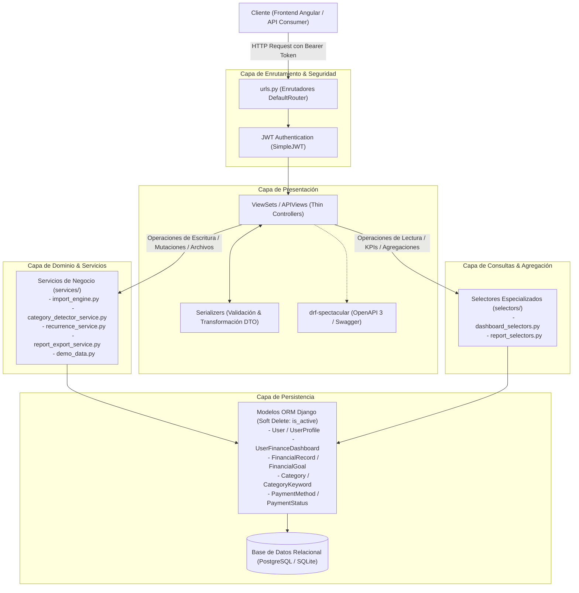

# Arquitectura del Sistema - GTOPagos Backend

Este documento detalla la arquitectura de software, la división en capas, los patrones de diseño y el flujo transaccional del backend de **GTOPagos**.

---

## 🏗️ Visión General de la Arquitectura

**GTOPagos_Back** es un servicio REST desarrollado en Python y Django REST Framework (DRF), estructurado bajo el principio de **Controladores Delgados (Thin Views)** combinado con una **Capa de Servicios (Service Layer)** para la lógica de negocio y un **Patrón de Selectores (Selector Pattern)** para las consultas optimizadas a la base de datos.

---

## 🛠️ Stack Tecnológico

- **Lenguaje:** Python 3.12.
- **Framework Web:** Django 5.x.
- **API Framework:** Django REST Framework (DRF).
- **Autenticación:** JSON Web Tokens (`djangorestframework-simplejwt`).
- **Documentación de API:** `drf-spectacular` (Generación de esquema OpenAPI 3 interactivo).
- **Procesamiento de Archivos:** `openpyxl` (Excel), `reportlab` (PDF).
- **Base de Datos:** PostgreSQL (Producción / Docker) y SQLite (Desarrollo local).
- **Contenedorización:** Docker con Gunicorn (`Dockerfile`, `docker-compose.yml`).

---

## 🧩 Estructura Modular de Aplicaciones (Apps)

El backend está organizado en aplicaciones cohesivas:

### 1. `users` (Gestión de Identidad y Preferencias)
- **Modelos:** `User` (autenticación vía email), `UserProfile` (datos personales, moneda `Currency`, frecuencia de ingresos `IncomeFrequency`, teléfono y preferencias de notificación).
- **Modo Demo (`demo_data.py`):** Motor de inicialización y resiembra dinámica de un usuario de pruebas aislado para portafolios y evaluaciones.
- **Endpoints:** `/api/login/`, `/api/demo-login/`, `/api/register/`, `/api/profile/`, `/api/token/`, `/api/token/refresh/`, `/api/forgot-password/`, `/api/reset-password/`.

### 2. `dashboard` (Contenedores y Métricas de Tablero)
- **Modelos:** `UserFinanceDashboard` (tableros temáticos: gastos, ingresos o ambos).
- **Selectores (`dashboard/selectors/dashboard_selectors.py`):** Concentra las agregaciones de base de datos para balances en tiempo real (`get_dashboard_summary`), transacciones recientes y vencimientos próximos.
- **Endpoints:** `/api/dashboards/`, `/api/dashboard/current/`, `/api/dashboard/recent-transactions/`, `/api/dashboard/upcoming-due/`, `/api/dashboards/<id>/records/`.

### 3. `finance` (Corazón Transaccional y Analítico)
- **Modelos:** `FinancialRecord`, `FinancialGoal` (metas de ahorro), `FinancialRecordType`, `Category` y `CategoryKeyword` (detección automática).
- **Servicios (`finance/services/`):**
  - `import_engine.py`: Análisis, mapeo y carga masiva de transacciones desde Excel.
  - `category_detector_service.py`: Deducción de categorías mediante matching de palabras clave normalizadas.
  - `recurrence_service.py`: Gestión de registros recurrentes y compras a meses sin intereses (MSI).
  - `report_export_service.py`: Renderizado y generación binaria de reportes en PDF y hojas de cálculo XLSX.
- **Selectores (`finance/selectors/report_selectors.py`):** Agregaciones temporales para reportes consolidados mensuales y anuales.
- **Endpoints:** `/api/financial-records/`, `/api/finance-categories/`, `/api/goals/`, `/api/import/preview/`, `/api/import/confirm/`, `/api/reports/data/`, `/api/reports/download/`, `/api/export/`, `/api/transactions/detect-category`.

### 4. `payments` (Catálogos Financieros)
- **Modelos:** `PaymentMethod` (Efectivo, Tarjeta de Crédito, Débito, Transferencia) y `PaymentStatus` (Pagado, Pendiente).
- **Endpoints:** `/api/payment-methods/`, `/api/payment-statuses/`.

---

## 📐 Patrones de Diseño Implementados

### 1. Patrón de Capa de Servicios (Service Layer)
Separa las reglas de negocio de los `ViewSets`:
- Los `ViewSets` solo validan la entrada HTTP mediante serializadores, invocan el servicio correspondiente y devuelven el resultado.
- Los servicios encapsulan transacciones atómicas (`@transaction.atomic`), llamadas multi-modelo y procesamiento pesado de documentos.

### 2. Patrón de Selectores (Selector Pattern)
Aísla la construcción de consultas complejas del ORM:
- Evita que las vistas contengan bloques extensos de `.annotate()`, `Case`, `When` o cálculos de sumatorias.
- Reutiliza la misma lógica de cálculo de métricas financieras entre endpoints REST y generadores de reportes sin duplicar código.

### 3. Borrado Lógico No Destructivo (Soft Delete)
- Implementado con el campo `is_active=BooleanField(default=True, db_index=True)`.
- Toda eliminación (`DELETE`) desactiva lógicamente el registro e inhabilita en cascada los movimientos dependientes, garantizando integridad histórica y auditoría contable.

### 4. Optimización contra Consultas N+1
- Uso intensivo de `select_related()` para relaciones de clave foránea unívocas (`user`, `record_type`, `category`, `payment_method`, `payment_status`).
- Uso de `prefetch_related()` para relaciones inversas o de muchos a muchos (`linked_records`, `keywords`).

